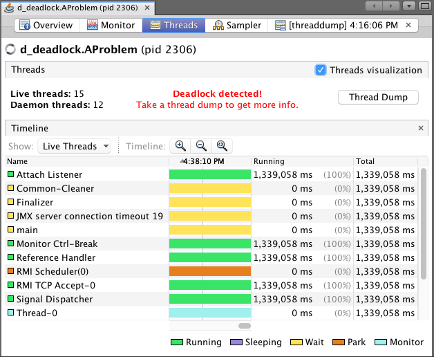

# Multi-threading Exercises

This project contains situations for and examples of using multi-threading constructs from JDK and other libraries.

# Content

## Hello World (`a_hello_world.HelloWorld`)

A warm up exercise to start a new thread and print out `Hello world`

## Volatile Keyword (`b_volatile.Volatile`)

Use `volatile` to create memory barrier to make sure the variable latest state is visible to other threads

## Race condition (`c_race_condition`)

Race condition is a situation that output depends on uncontrolled events.

### Problem (`AProblem`)

Showing a common scenario causing race condition, two or more threads performing increment in a shared integer.

### Fix with `synchronized` block (`BFixWithSynchronizedBlock`)

As with many problems in multi-threading, you can lock the increment code with `synchronized` block with the price of performance.

### Fix with `ReentrantLock` (`CFixByReenterantLock`)

You can also lock the increment code with `ReentrantLock`. Additionally, it can set a timeout when try to acquire the lock so that it won't be blocked forever.

### Fix with compare and swap (`DFixByCAS`)

For increment (and also decrement) operations, such as id generation, compare and swap (CAS) is more desirable since it is an atomic operation and don't require lock. In Java,  `Atomic*` objects provide CAS operations.

## Deadlock (`d_deadlock`)

Deadlock is a state that threads waiting for lock that is acquired by others, causing the process to wait indefinitely.

### Problem(`AProblem`)

Create deadlock by making a thread to lock on object `a` and wait for object `b` while other thread is doing the reverse.

### Fix with reentrant lock (`BFixWithReentrantLock`)

`ReentrantLock` provides method to lock and give up if timeout is provided. This allows process to wait for at most certain amount of time to avoid deadlock.

### Fix with queue (`CFixWithQueue`)

All requests to given resource queues up and processed one be one. Single threaded executor guarantees all submitted tasks are executed sequentially by an unbounded queue.

## Robot Laboratory (`e_robot_laboratory`)

In this laboratory, workers work on their own part, namely head and body, to produce single robot.

### By count down latch (`ByCountDownLatch`)

With count down latch, a thread can wait for multiple threads to signal before continue it's work. Here, the count down latch is initialized with 2. Workers would call `countDown()` on the `CountDownLatch`. Once all work is done, thread would be wake up and execute code after `latch.await();`.

### By future (`ByFuture`)

Workers are modeled into `Callable` for making head and body. Then they're submit to an executor service. Products by workers are obtained via `get()` on `Future` object returned during submission.

## Burger Production Line (`f_burger_production`)

In this production line, many burgers are created by different workers producing meat and bun.

### By Disruptor

[Disruptor from LMAX](https://github.com/LMAX-Exchange/disruptor) is used for producing 100 burgers, meat worker and bun worker put meat and bun into the burger (Event) separately.

# Attribution

This project mainly inspired by https://github.com/alagesh/MultiThreading. I code according the README.md and rearrange some usecases.
